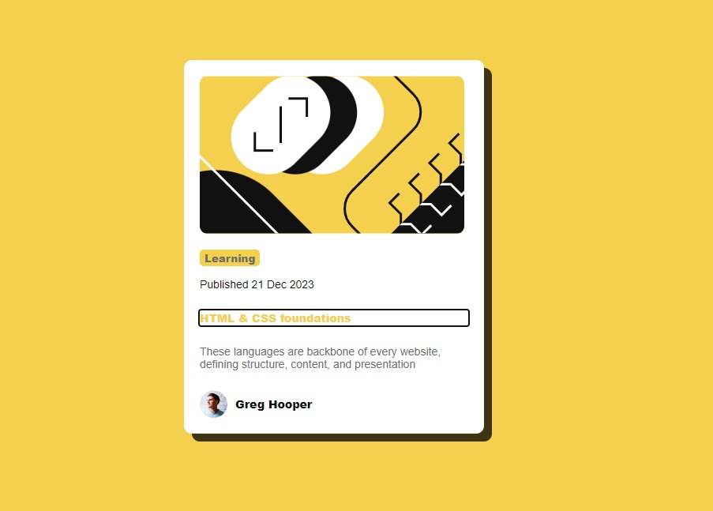

# Blog preview card solution

This is a solution to the [Blog preview card ](https://www.frontendmentor.io/challenges/blog-preview-card-ckPaj01IcS).

## Table of contents

- [Overview](#overview)
  - [The challenge](#the-challenge)
  - [Screenshot](#screenshot)
  - [Links](#links)
- [My process](#my-process)
  - [Built with](#built-with)

## Overview

### The challenge

Users should be able to:

- See hover and focus states for all interactive elements on the page

### Screenshot

- Static
  
- Active
  

### Links

- Solution URL: [Add solution URL here](https://github.com/VitaliySaburdo/blog-preview-card)
- Live Site URL: [Add live site URL here](https://vitaliysaburdo.github.io/blog-preview-card/)

## My process

### Built with

- Semantic HTML5 markup
- CSS custom properties
- Flexbox
- Mobile-first workflow
